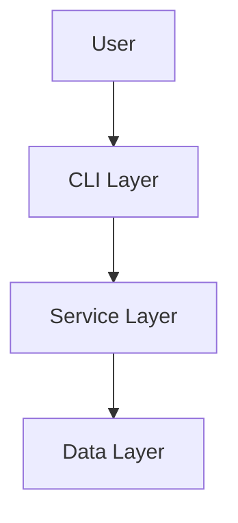
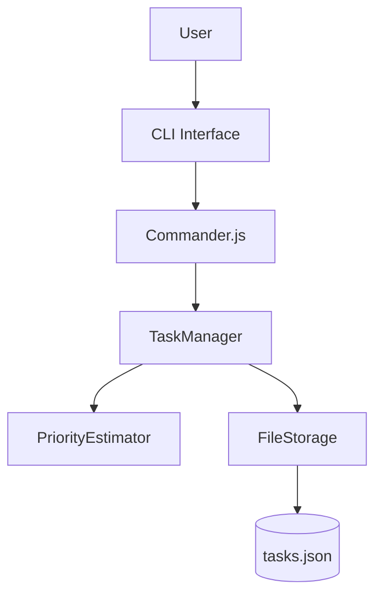
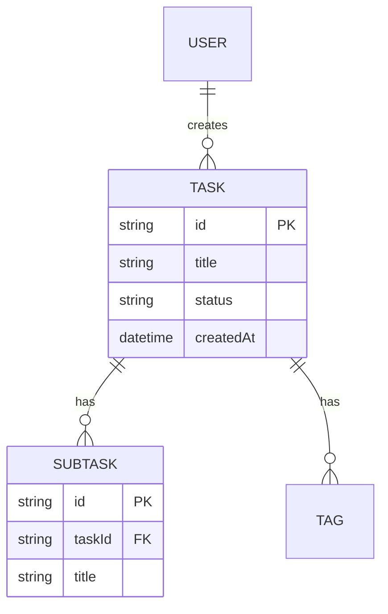
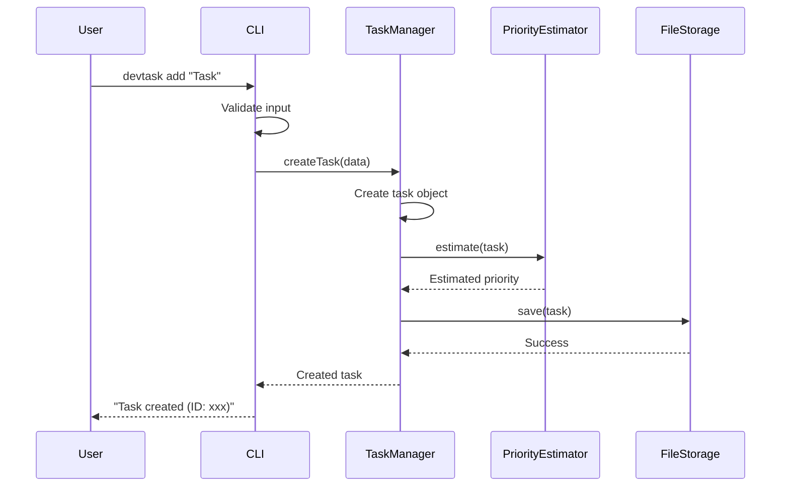

# Functional Design Document Creation Guide

This guide provides practical guidance for creating a functional design document based on the Product Requirements Document (PRD).

## Purpose of the Functional Design Document

The functional design document translates the "what to build" defined in the PRD into "how to realize it".

**Main contents**:
- System architecture diagram
- Data models
- Component design
- Algorithm design (if applicable)
- UI design
- Error handling

## Basic Creation Flow

### Step 1: Review the PRD

Before creating the functional design document, always review the PRD.

```
Example prompt for asking Claude Code to create a functional design document from the PRD:

Create a functional design document based on the contents of the PRD.
Focus especially on the priority P0 (MVP) features.
```

### Step 2: Create the System Architecture Diagram

#### Use Mermaid Notation

Describe the system architecture diagram in Mermaid notation.

**Basic 3-layer architecture example**:


**More detailed example**:


### Step 3: Define the Data Models

#### Make Them Explicit with TypeScript Type Definitions

Define data models with TypeScript interfaces.

**Basic Task type example**:
```typescript
interface Task {
  id: string;                    // UUID v4
  title: string;                 // 1-200 characters
  description?: string;          // Optional, Markdown format
  status: TaskStatus;            // 'todo' | 'in_progress' | 'completed'
  priority: TaskPriority;        // 'high' | 'medium' | 'low'
  estimatedPriority?: TaskPriority;  // Automatically estimated priority
  dueDate?: Date;                // Due date
  createdAt: Date;               // Creation timestamp
  updatedAt: Date;               // Update timestamp
  statusHistory?: StatusChange[]; // Status change history
}

type TaskStatus = 'todo' | 'in_progress' | 'completed';
type TaskPriority = 'high' | 'medium' | 'low';

interface StatusChange {
  from: TaskStatus;
  to: TaskStatus;
  changedAt: Date;
}
```

**Key points**:
- Add an explanatory comment to each field
- Explicitly state constraints (character limits, formats, etc.)
- Mark optional fields with `?`
- Improve readability with type aliases

#### Create an ER Diagram

When there are multiple entities, show their relationships with an ER diagram.



### Step 4: Component Design

Make the responsibilities of each layer explicit.

#### CLI Layer

**Responsibilities**: Accept user input, validate it, and display results

```typescript
// CommandLineInterface
class CLI {
  // Accept user input
  parseArguments(): Command;

  // Display results
  displayResult(result: Result): void;

  // Display errors
  displayError(error: Error): void;
}
```

#### Service Layer

**Responsibilities**: Implement business logic

```typescript
// TaskManager
class TaskManager {
  // Create a task
  createTask(data: CreateTaskData): Task;

  // Get the task list
  listTasks(filter?: FilterOptions): Task[];

  // Update a task
  updateTask(id: string, data: UpdateTaskData): Task;

  // Delete a task
  deleteTask(id: string): void;
}
```

#### Data Layer

**Responsibilities**: Persist and retrieve data

```typescript
// FileStorage
class FileStorage {
  // Save data
  save(data: any): void;

  // Load data
  load(): any;

  // Check whether the file exists
  exists(): boolean;
}
```

### Step 5: Algorithm Design (If Applicable)

Design complex logic (e.g., automatic priority estimation) in detail.

#### Example: Automatic Priority Estimation Algorithm

**Purpose**: Automatically estimate priority from a task's due date, creation timestamp, and status

**Calculation logic**:

##### Step 1: Calculate the deadline score (0-100 points)
```
- Past due: 100 points (maximum)
- 0-3 days until due: 90 points
- 4-7 days until due: 70 points
- 8-14 days until due: 50 points
- More than 14 days until due: 30 points
- No due date set: 20 points
```

**Formula**:
```typescript
function calculateDeadlineScore(dueDate?: Date): number {
  if (!dueDate) return 20;

  const now = new Date();
  const daysRemaining = Math.floor((dueDate.getTime() - now.getTime()) / (1000 * 60 * 60 * 24));

  if (daysRemaining < 0) return 100;  // Past due
  if (daysRemaining <= 3) return 90;
  if (daysRemaining <= 7) return 70;
  if (daysRemaining <= 14) return 50;
  return 30;
}
```

##### Step 2: Calculate the age score (0-100 points)
```
- 30+ days since creation: 100 points (maximum)
- 21-30 days since creation: 80 points
- 14-21 days since creation: 60 points
- 7-14 days since creation: 40 points
- Less than 7 days since creation: 20 points
```

**Formula**:
```typescript
function calculateAgeScore(createdAt: Date): number {
  const now = new Date();
  const daysOld = Math.floor((now.getTime() - createdAt.getTime()) / (1000 * 60 * 60 * 24));

  if (daysOld >= 30) return 100;
  if (daysOld >= 21) return 80;
  if (daysOld >= 14) return 60;
  if (daysOld >= 7) return 40;
  return 20;
}
```

##### Step 3: Calculate the status score (0-100 points)
```
- In progress (in_progress): 100 points (highest priority)
- Not started (todo): 50 points
- Completed (completed): 0 points
```

**Formula**:
```typescript
function calculateStatusScore(status: TaskStatus): number {
  if (status === 'in_progress') return 100;
  if (status === 'todo') return 50;
  return 0;  // completed
}
```

##### Step 4: Calculate the total score

**Weighted average**:
```
Total score = (deadline score × 50%) + (age score × 20%) + (status score × 30%)
```

**Formula**:
```typescript
function calculateTotalScore(task: Task): number {
  const deadlineScore = calculateDeadlineScore(task.dueDate);
  const ageScore = calculateAgeScore(task.createdAt);
  const statusScore = calculateStatusScore(task.status);

  return (deadlineScore * 0.5) + (ageScore * 0.2) + (statusScore * 0.3);
}
```

##### Step 5: Classify priority

**Classification by thresholds**:
```
- 70 points or more: high
- 40-70 points: medium
- Less than 40 points: low
```

**Formula**:
```typescript
function estimatePriority(task: Task): TaskPriority {
  const score = calculateTotalScore(task);

  if (score >= 70) return 'high';
  if (score >= 40) return 'medium';
  return 'low';
}
```

**Complete implementation example**:
```typescript
class PriorityEstimator {
  estimate(task: Task): TaskPriority {
    const deadlineScore = this.calculateDeadlineScore(task.dueDate);
    const ageScore = this.calculateAgeScore(task.createdAt);
    const statusScore = this.calculateStatusScore(task.status);

    const totalScore = (deadlineScore * 0.5) + (ageScore * 0.2) + (statusScore * 0.3);

    if (totalScore >= 70) return 'high';
    if (totalScore >= 40) return 'medium';
    return 'low';
  }

  private calculateDeadlineScore(dueDate?: Date): number {
    if (!dueDate) return 20;

    const now = new Date();
    const daysRemaining = Math.floor((dueDate.getTime() - now.getTime()) / (1000 * 60 * 60 * 24));

    if (daysRemaining < 0) return 100;
    if (daysRemaining <= 3) return 90;
    if (daysRemaining <= 7) return 70;
    if (daysRemaining <= 14) return 50;
    return 30;
  }

  private calculateAgeScore(createdAt: Date): number {
    const now = new Date();
    const daysOld = Math.floor((now.getTime() - createdAt.getTime()) / (1000 * 60 * 60 * 24));

    if (daysOld >= 30) return 100;
    if (daysOld >= 21) return 80;
    if (daysOld >= 14) return 60;
    if (daysOld >= 7) return 40;
    return 20;
  }

  private calculateStatusScore(status: TaskStatus): number {
    if (status === 'in_progress') return 100;
    if (status === 'todo') return 50;
    return 0;
  }
}
```

### Step 6: Use Case Diagrams

Express the main use cases with sequence diagrams.

**Task addition flow**:


### Step 7: UI Design (If Applicable)

For CLI tools, define table display and color coding.

#### Table Display

```
┌──────────┬──────────────────┬────────────┬──────────┬───────────────┐
│ ID       │ Title            │ Status     │ Priority │ Due           │
├──────────┼──────────────────┼────────────┼──────────┼───────────────┤
│ 7a5c6ff0 │ Buy milk on the  │ Todo       │ High     │ 2025-11-05    │
│          │ way home         │            │          │ (1 day left)  │
└──────────┴──────────────────┴────────────┴──────────┴───────────────┘
```

#### Color Coding

**Status colors**:
- Completed (completed): green
- In progress (in_progress): yellow
- Not started (todo): white

**Priority colors**:
- High (high): red
- Medium (medium): yellow
- Low (low): blue

### Step 8: File Structure (If Applicable)

Define the data storage format.

**Example: data storage for a CLI tool**:
```
.devtask/
├── tasks.json      # Task data
└── config.json     # Configuration data
```

**tasks.json example**:
```json
{
  "tasks": [
    {
      "id": "7a5c6ff0-5f55-474e-baf7-ea13624d73a4",
      "title": "Buy milk on the way home",
      "description": "",
      "status": "todo",
      "priority": "high",
      "estimatedPriority": "medium",
      "dueDate": "2025-11-05T00:00:00.000Z",
      "createdAt": "2025-11-04T10:00:00.000Z",
      "updatedAt": "2025-11-04T10:00:00.000Z"
    }
  ]
}
```

### Step 9: Error Handling

Define the error types and how to handle them.

| Error type | Handling | Message shown to the user |
|-----------|------|-----------------|
| Input validation error | Abort processing, display an error message | "The title must be 1-200 characters" |
| File read error | Continue with empty initial data | "Data file not found. Creating a new one" |
| Task not found | Abort processing, display an error message | "Task not found (ID: xxx)" |

## Reviewing the Functional Design Document

### Review Perspectives

Ask Claude Code to review it:

```
Evaluate this functional design document. Check it from the following perspectives:

1. Does it satisfy the requirements in the PRD?
2. Are the data models concrete?
3. Are the component responsibilities clear?
4. Are the algorithms detailed to an implementable level?
5. Is the error handling comprehensive?
```

### Applying Improvements

Improve the document based on Claude Code's feedback.

## Summary

Keys to successfully creating a functional design document:

1. **Consistency with the PRD**: Accurately reflect the requirements defined in the PRD
2. **Use Mermaid notation**: Express things visually with diagrams
3. **TypeScript type definitions**: Make data models explicit
4. **Detailed algorithm design**: Make complex logic concrete
5. **Layer separation**: Make each component's responsibilities clear
6. **Implementable level of detail**: Detailed enough for developers to implement without hesitation
