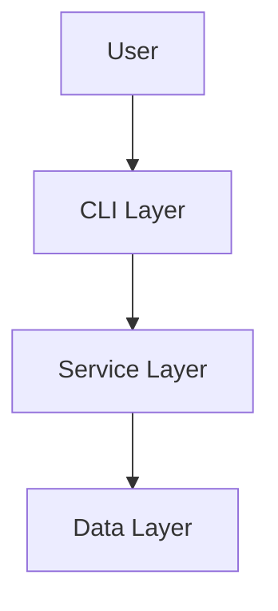
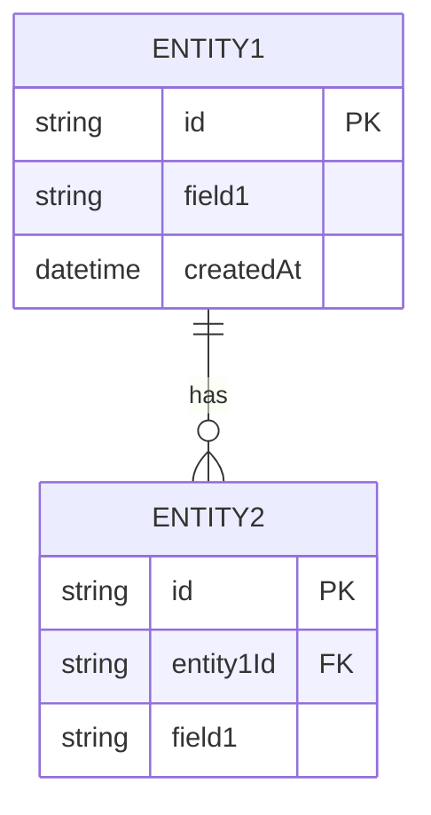
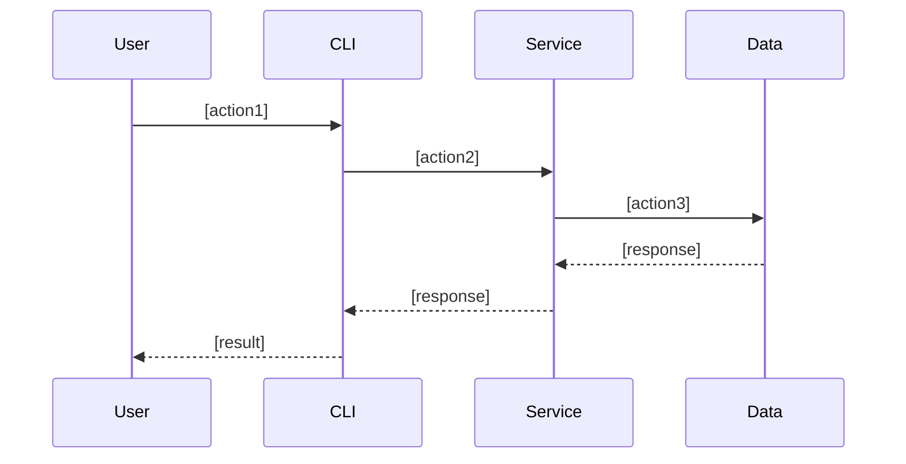
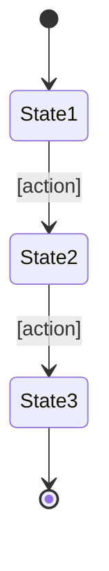

# Functional Design Document

## System Architecture Diagram



## Technology Stack

| Category | Technology | Reason for selection |
|------|------|----------|
| Language | [Language name] | [Reason] |
| Framework | [Name] | [Reason] |
| Database | [Name] | [Reason] |
| Tools | [Name] | [Reason] |

## Data Model Definitions

### Entity: [Entity name]

```typescript
interface [EntityName] {
  id: string;              // UUID
  [field1]: [type];        // [Description]
  [field2]: [type];        // [Description]
  createdAt: Date;         // Creation timestamp
  updatedAt: Date;         // Update timestamp
}
```

**Constraints**:
- [Constraint 1]
- [Constraint 2]

### ER Diagram



## Component Design

### [Component 1]

**Responsibilities**:
- [Responsibility 1]
- [Responsibility 2]

**Interface**:
```typescript
class [ComponentName] {
  [method1]([params]): [return];
  [method2]([params]): [return];
}
```

**Dependencies**:
- [Dependency 1]
- [Dependency 2]

## Use Case Diagrams

### [Use case 1]



**Flow description**:
1. [Step 1]
2. [Step 2]
3. [Step 3]

## Screen Transition Diagram (if applicable)



## API Design (if applicable)

### [Endpoint 1]

```
POST /api/[resource]
```

**Request**:
```json
{
  "[field]": "[value]"
}
```

**Response**:
```json
{
  "id": "uuid",
  "[field]": "[value]"
}
```

**Error responses**:
- 400 Bad Request: [Condition]
- 404 Not Found: [Condition]
- 500 Internal Server Error: [Condition]

## Algorithm Design (if applicable)

### [Algorithm name]

**Purpose**: [Description]

**Calculation logic**:

#### Step 1: [Step name]
- [Detailed description]
- Formula: `[formula]`
- Score range: 0-100 points

#### Step 2: [Step name]
- [Detailed description]
- Formula: `[formula]`
- Score range: 0-100 points

#### Step 3: Total score calculation
- Weighted average: `Total score = (Step 1 × weight 1) + (Step 2 × weight 2)`
- Weight distribution:
  - Step 1: [%]
  - Step 2: [%]

#### Step 4: Classification
- [Class 1]: score >= [threshold]
- [Class 2]: [threshold] <= score < [threshold]
- [Class 3]: score < [threshold]

**Implementation example**:
```typescript
function [algorithmName]([params]): [return] {
  // Step 1
  const score1 = [calculation];

  // Step 2
  const score2 = [calculation];

  // Total score
  const totalScore = (score1 * weight1) + (score2 * weight2);

  // Classification
  if (totalScore >= threshold1) return '[class1]';
  if (totalScore >= threshold2) return '[class2]';
  return '[class3]';
}
```

## UI Design (if applicable)

### Table Display

**Displayed columns**:
| Column | Description | Format |
|------|------|-------------|
| [Column 1] | [Description] | [Format] |
| [Column 2] | [Description] | [Format] |

### Color Coding

**Color usage**:
- [Color 1]: [Purpose] (e.g., green = completed)
- [Color 2]: [Purpose] (e.g., yellow = in progress)
- [Color 3]: [Purpose] (e.g., red = not started)

### Interactive Mode (if applicable)

**Operation flow**:
1. [Operation 1]
2. [Operation 2]
3. [Operation 3]

## File Structure (if applicable)

**Data storage format**:
```
[directory]/
├── [file1].json    # [Description]
└── [file2].json    # [Description]
```

**Example file contents**:
```json
{
  "[field]": "[value]"
}
```

## Performance Optimization

- [Optimization 1]: [Description]
- [Optimization 2]: [Description]

## Security Considerations

- [Consideration 1]: [Countermeasure]
- [Consideration 2]: [Countermeasure]

## Error Handling

### Error Classification

| Error type | Handling | Message shown to the user |
|-----------|------|-----------------|
| [Type 1] | [Handling] | [Message] |
| [Type 2] | [Handling] | [Message] |

## Test Strategy

### Unit Tests
- [Target 1]
- [Target 2]

### Integration Tests
- [Scenario 1]
- [Scenario 2]

### E2E Tests
- [Scenario 1]
- [Scenario 2]
