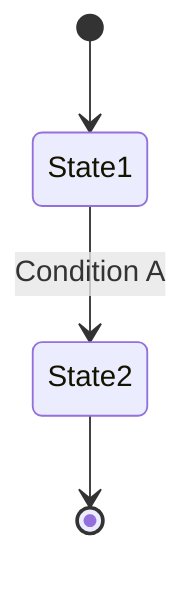

# Project Glossary

## Overview

This document manages the definitions of terms used within the project.

**Last updated**: [YYYY-MM-DD]

## Domain Terms

Terms related to project-specific business concepts and features.

### [Term 1]

**Definition**: [Clear definition]

**Description**: [Detailed description]

**Related terms**: [Other related terms]

**Usage examples**:
- [Example 1]
- [Example 2]

**English notation**: [English Term]

### [Term 2]

**Definition**: [Clear definition]

**Description**: [Detailed description]

**Related terms**: [Other related terms]

**Usage examples**:
- [Example 1]
- [Example 2]

## Technical Terms

Terms related to technologies, frameworks, and tools used in the project.

### [Technology 1]

**Definition**: [Description of the technology]

**Official site**: [URL]

**Usage in this project**: [How it is used]

**Version**: [Version in use]

**Related documents**: [Links to internal documents]

### [Technology 2]

**Definition**: [Description of the technology]

**Official site**: [URL]

**Usage in this project**: [How it is used]

**Version**: [Version in use]

## Abbreviations and Acronyms

### [Abbreviation 1]

**Full name**: [Full Name]

**Meaning**: [Description]

**Usage in this project**: [Where it is used]

### [Abbreviation 2]

**Full name**: [Full Name]

**Meaning**: [Description]

**Usage in this project**: [Where it is used]

## Architecture Terms

Terms related to system design and architecture.

### [Concept 1]

**Definition**: [Description of the architectural concept]

**Application in this project**: [How it is implemented]

**Related components**: [Names of related components]

**Diagram**:
```
[ASCII diagram or Mermaid diagram]
```

### [Concept 2]

**Definition**: [Description of the architectural concept]

**Application in this project**: [How it is implemented]

## Statuses and States

Definitions of the various statuses used within the system.

### [Status Type 1]

| Status | Meaning | Transition Condition | Next State |
|----------|------|---------|---------|
| [State 1] | [Description] | [Condition] | [Next state] |
| [State 2] | [Description] | [Condition] | [Next state] |

**State transition diagram**:


## Data Model Terms

Terms related to databases and data structures.

### [Entity 1]

**Definition**: [Description of the entity]

**Key fields**:
- `field1`: [Description]
- `field2`: [Description]

**Related entities**: [Related entities]

**Constraints**: [Unique constraints, foreign key constraints, etc.]

## Errors and Exceptions

Errors and exceptions defined in the system.

### [Error Type 1]

**Class name**: `[ErrorClassName]`

**Occurrence conditions**: [When it occurs]

**Remediation**: [How the user/developer should respond]

**Error code**: [If applicable]

**Example**:
```typescript
throw new [ErrorClassName]('[Message]');
```

## Calculations and Algorithms (if applicable)

Terms related to specific calculation methods and algorithms.

### [Calculation Method 1]

**Definition**: [Description of the calculation method]

**Formula**:
```
[Formula]
```

**Implementation location**: `src/[path]/[file].ts`

**Example**:
```
Input: [Example]
Output: [Result]
```
