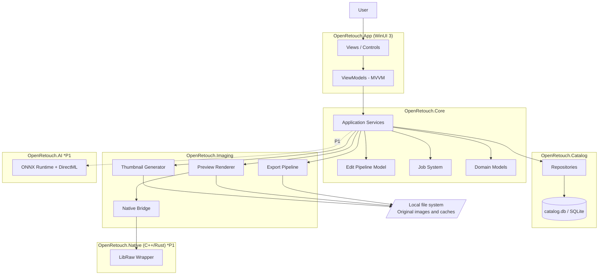
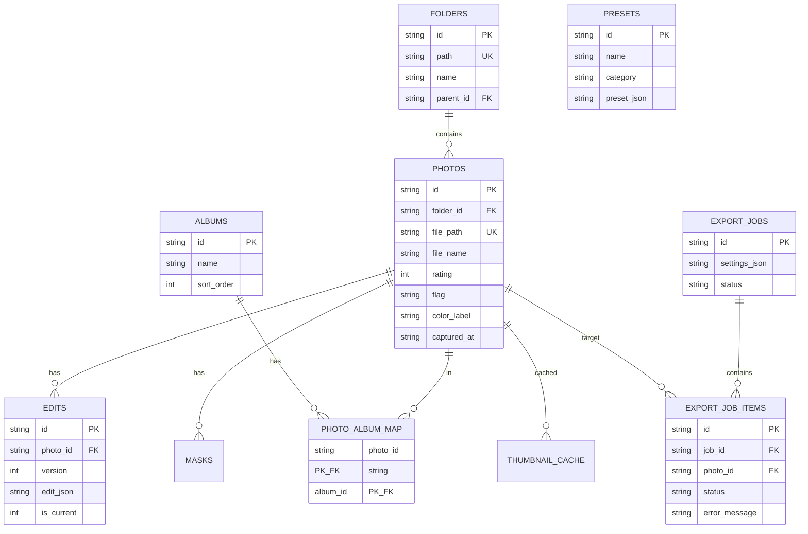
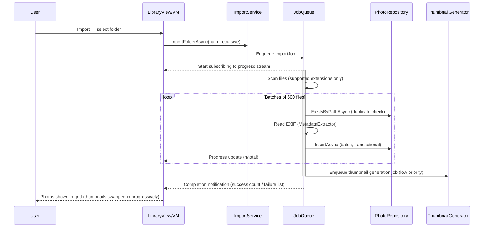
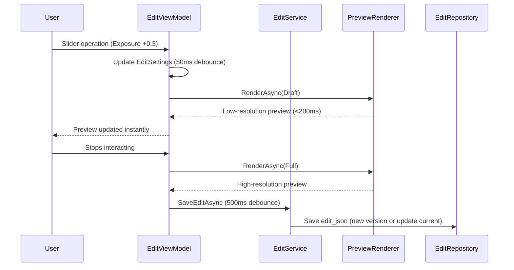
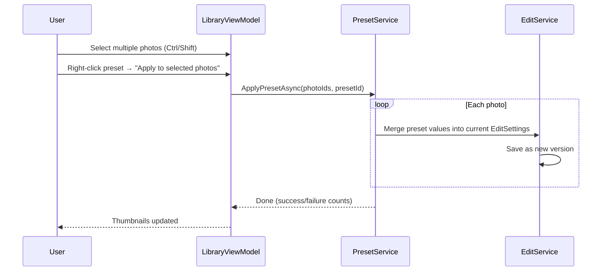
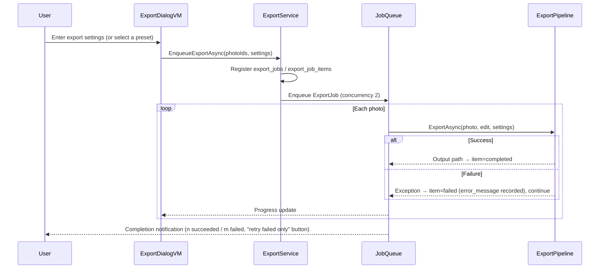
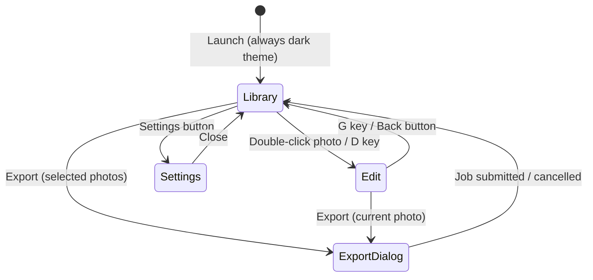

# Functional Design Document

This document defines how the requirements specified in `docs/product-requirements.md` (PRD) are to be realized technically.
It primarily covers the priority P0 (MVP) features F-01 through F-07, while P1 features (RAW and AI) are incorporated into the design as extension points.

## System Architecture Diagram



### Layer Responsibilities Overview

| Layer | Responsibility | Depends on |
|---------|------|--------|
| App | UI rendering, user input, screen navigation, MVVM binding | Core |
| Core | Business logic, edit model, job management, service orchestration | Catalog, Imaging |
| Catalog | Persistence to SQLite, data access via the repository pattern | SQLite |
| Imaging | Image processing for thumbnails / previews / export | File system, Native |
| Native | RAW decoding, high-speed image processing (P1 and later) | LibRaw, etc. |
| AI | ONNX model inference (P1 and later) | ONNX Runtime |

**Dependency direction principle**: One-way only: App → Core → (Catalog / Imaging). References in the reverse direction are prohibited. Notifications to the UI are delivered via events/Observables.

## Technology Stack

| Category | Technology | Rationale |
|------|------|----------|
| Language | C# (.NET 8 or later) | Productivity and ecosystem for Windows desktop development |
| UI framework | WinUI 3 (Windows App SDK) | Modern native Windows UI with dark theme support |
| MVVM | CommunityToolkit.Mvvm | Reduces boilerplate via source generators; the de facto standard |
| DI | Microsoft.Extensions.DependencyInjection | .NET standard; loose coupling of services/repositories |
| Database | SQLite | Embedded, fully local, single-file — ideal for catalog management |
| Data access | Dapper (+ Microsoft.Data.Sqlite) | Lightweight and fast. The catalog is mostly simple CRUD, so EF Core would be overkill |
| Image processing (C#) | SkiaSharp | Fast GPU-assisted drawing/resizing/encoding; good fit with WinUI |
| EXIF reading | MetadataExtractor | Proven track record reading metadata for all major formats |
| Logging | Serilog | Structured logging, file output (`logs/app.log`) |
| Testing | xUnit + FluentAssertions | Standard .NET testing stack |
| RAW (P1) | LibRaw (via Native Module) | The de facto standard for RAW decoding |
| AI (P1) | ONNX Runtime + DirectML | Local inference, GPU-vendor-agnostic acceleration |

## Data Model Definition

### ER Diagram



### SQLite Schema

```sql
CREATE TABLE folders (
    id TEXT PRIMARY KEY,              -- UUID
    path TEXT NOT NULL UNIQUE,        -- Absolute path
    name TEXT NOT NULL,
    parent_id TEXT,                   -- For folder tree (NULL = root)
    created_at TEXT NOT NULL,
    FOREIGN KEY(parent_id) REFERENCES folders(id)
);

CREATE TABLE photos (
    id TEXT PRIMARY KEY,              -- UUID
    folder_id TEXT NOT NULL,
    file_path TEXT NOT NULL UNIQUE,   -- Absolute path (duplicate-detection key)
    file_name TEXT NOT NULL,
    file_extension TEXT NOT NULL,     -- ".jpg" etc. (normalized to lowercase)
    file_size INTEGER,
    file_hash TEXT,                   -- For future enhanced duplicate detection (optional)
    imported_at TEXT NOT NULL,        -- ISO 8601
    captured_at TEXT,                 -- EXIF capture date/time (ISO 8601)
    width INTEGER,
    height INTEGER,
    orientation INTEGER DEFAULT 1,    -- EXIF Orientation
    camera_make TEXT,
    camera_model TEXT,
    lens_model TEXT,
    iso INTEGER,
    aperture REAL,
    shutter_speed TEXT,
    focal_length REAL,
    rating INTEGER NOT NULL DEFAULT 0,        -- 0-5
    flag TEXT,                        -- 'pick' | 'reject' | NULL
    color_label TEXT,                 -- 'red'|'yellow'|'green'|'blue'|'purple'|NULL
    is_missing INTEGER NOT NULL DEFAULT 0,    -- Original file missing flag
    FOREIGN KEY(folder_id) REFERENCES folders(id)
);
CREATE INDEX idx_photos_captured_at ON photos(captured_at);
CREATE INDEX idx_photos_rating ON photos(rating);
CREATE INDEX idx_photos_folder ON photos(folder_id);

CREATE TABLE edits (
    id TEXT PRIMARY KEY,
    photo_id TEXT NOT NULL,
    version INTEGER NOT NULL,         -- Edit history version (increments from 1)
    edit_json TEXT NOT NULL,          -- Edit parameter JSON (described below)
    is_current INTEGER NOT NULL DEFAULT 1, -- Whether this is the currently applied version
    created_at TEXT NOT NULL,
    updated_at TEXT NOT NULL,
    FOREIGN KEY(photo_id) REFERENCES photos(id),
    UNIQUE(photo_id, version)
);
CREATE INDEX idx_edits_photo ON edits(photo_id);

CREATE TABLE albums (
    id TEXT PRIMARY KEY,
    name TEXT NOT NULL,
    sort_order INTEGER NOT NULL DEFAULT 0,
    created_at TEXT NOT NULL,
    updated_at TEXT NOT NULL
);

CREATE TABLE photo_album_map (
    photo_id TEXT NOT NULL,
    album_id TEXT NOT NULL,
    added_at TEXT NOT NULL,
    PRIMARY KEY(photo_id, album_id),
    FOREIGN KEY(photo_id) REFERENCES photos(id),
    FOREIGN KEY(album_id) REFERENCES albums(id)
);

CREATE TABLE presets (
    id TEXT PRIMARY KEY,
    name TEXT NOT NULL,
    category TEXT,
    preset_json TEXT NOT NULL,        -- JSON subset of edit parameters
    sort_order INTEGER NOT NULL DEFAULT 0,
    created_at TEXT NOT NULL,
    updated_at TEXT NOT NULL
);

CREATE TABLE export_jobs (
    id TEXT PRIMARY KEY,
    settings_json TEXT NOT NULL,      -- Export settings JSON (described below)
    status TEXT NOT NULL,             -- 'pending'|'running'|'completed'|'failed'|'cancelled'
    created_at TEXT NOT NULL,
    completed_at TEXT
);

CREATE TABLE export_job_items (
    id TEXT PRIMARY KEY,
    job_id TEXT NOT NULL,
    photo_id TEXT NOT NULL,
    status TEXT NOT NULL,             -- 'pending'|'running'|'completed'|'failed'
    output_path TEXT,
    error_message TEXT,
    FOREIGN KEY(job_id) REFERENCES export_jobs(id),
    FOREIGN KEY(photo_id) REFERENCES photos(id)
);

CREATE TABLE thumbnail_cache (
    photo_id TEXT PRIMARY KEY,
    thumb_path TEXT NOT NULL,         -- Cache file path
    preview_path TEXT,                -- Preview cache path
    source_modified_at TEXT NOT NULL, -- Source file modification time (for invalidation checks)
    generated_at TEXT NOT NULL,
    FOREIGN KEY(photo_id) REFERENCES photos(id)
);

-- P1: masks / ai_jobs will be added when the AI features are implemented
```

### Domain Model (C#)

```csharp
public sealed class Photo
{
    public required string Id { get; init; }              // UUID
    public required string FolderId { get; init; }
    public required string FilePath { get; init; }         // Absolute path
    public required string FileName { get; init; }
    public required string FileExtension { get; init; }    // Lowercase ".jpg" etc.
    public long FileSize { get; init; }
    public DateTimeOffset ImportedAt { get; init; }
    public DateTimeOffset? CapturedAt { get; set; }
    public int Width { get; set; }
    public int Height { get; set; }
    public int Orientation { get; set; } = 1;
    public ExifInfo Exif { get; set; } = new();
    public int Rating { get; set; }                        // 0-5
    public PhotoFlag Flag { get; set; }                    // None | Pick | Reject
    public ColorLabel ColorLabel { get; set; }             // None | Red | ...
    public bool IsMissing { get; set; }
}

public sealed class ExifInfo
{
    public string? CameraMake { get; set; }
    public string? CameraModel { get; set; }
    public string? LensModel { get; set; }
    public int? Iso { get; set; }
    public double? Aperture { get; set; }
    public string? ShutterSpeed { get; set; }
    public double? FocalLength { get; set; }
}

public enum PhotoFlag { None, Pick, Reject }
public enum ColorLabel { None, Red, Yellow, Green, Blue, Purple }
```

### Edit Parameters (EditSettings)

The core model of non-destructive editing. Stored in the DB as JSON in `edits.edit_json`.

```csharp
public sealed class EditSettings
{
    public int Version { get; init; } = 1;          // Schema version
    public BasicAdjustments Basic { get; set; } = new();
    public CropSettings? Crop { get; set; }
    public List<MaskAdjustment> Masks { get; set; } = [];  // P1
}

public sealed class BasicAdjustments
{
    // All value ranges map 1:1 to the UI sliders
    public double Exposure { get; set; }       // -5.0 .. +5.0 (EV)
    public int Contrast { get; set; }          // -100 .. +100
    public int Highlights { get; set; }        // -100 .. +100
    public int Shadows { get; set; }           // -100 .. +100
    public int Whites { get; set; }            // -100 .. +100
    public int Blacks { get; set; }            // -100 .. +100
    public int Temperature { get; set; }       // -100 .. +100 (relative correction; non-RAW files have no absolute color temperature reference point)
    public int Tint { get; set; }              // -150 .. +150
    public int Saturation { get; set; }        // -100 .. +100
    public int Vibrance { get; set; }          // -100 .. +100
    // ---- P1 ----
    public int Clarity { get; set; }           // -100 .. +100
    public int Texture { get; set; }           // -100 .. +100
    public int Dehaze { get; set; }            // -100 .. +100
    public int Sharpening { get; set; }        // 0 .. 150
    public int NoiseReduction { get; set; }    // 0 .. 100
}

public sealed class CropSettings
{
    // All values are normalized coordinates (0.0-1.0) relative to the orientation-normalized image
    // Application order: RotationSteps (90 degrees) → Flip → Straighten → Crop extraction
    public double X { get; set; }
    public double Y { get; set; }
    public double Width { get; set; } = 1.0;
    public double Height { get; set; } = 1.0;
    public double Straighten { get; set; }     // -45 .. +45 degrees (angle correction with inscribed zoom)
    public int RotationSteps { get; set; }     // Rotation in 90-degree steps (0-3 = 0/90/180/270 degrees clockwise)
    public bool FlipHorizontal { get; set; }
    public bool FlipVertical { get; set; }
    public string AspectRatio { get; set; }    // "free" | "1:1" | "4:5" | "16:9" | "3:2"
}
```

**JSON example**:

```json
{
  "version": 1,
  "basic": {
    "exposure": 0.35, "contrast": 12, "highlights": -30, "shadows": 20,
    "whites": 5, "blacks": -8, "temperature": 12, "tint": 4,
    "vibrance": 18, "saturation": 5,
    "clarity": 0, "texture": 0, "dehaze": 0, "sharpening": 0, "noiseReduction": 0
  },
  "crop": {
    "x": 0.1, "y": 0.05, "width": 0.8, "height": 0.8,
    "rotation": 0.3, "orientation": 0,
    "flipHorizontal": false, "flipVertical": false, "aspectRatio": "4:5"
  },
  "masks": []
}
```

**Constraints**:
- Unknown JSON fields are ignored, and missing fields are filled with default values (forward compatibility)
- Schema evolution is handled via `version` (a migration function is provided)
- Presets (`presets.preset_json`) are a subset of `EditSettings` (typically `basic` only; `crop` is not included)

### Export Settings (ExportSettings)

```csharp
public sealed class ExportSettings
{
    public required string OutputFolder { get; set; }
    public string FileNameTemplate { get; set; } = "{filename}";
        // Tokens: {filename} {seq} {date} {album}
    public ExportFormat Format { get; set; } = ExportFormat.Jpeg;  // Jpeg|Png|Tiff
    public int JpegQuality { get; set; } = 90;                     // 1-100
    public ResizeMode ResizeMode { get; set; } = ResizeMode.None;
        // None | LongEdge | ShortEdge | WidthHeight
    public int? ResizeValue { get; set; }                          // px
    public MetadataPolicy Metadata { get; set; } = new();
    public ConflictPolicy Conflict { get; set; } = ConflictPolicy.Rename;
        // Rename (append sequence number) | Overwrite | Skip
}

public sealed class MetadataPolicy
{
    public bool KeepExif { get; set; } = true;
    public bool RemoveGps { get; set; }          // GPS can be removed independently even when KeepExif=true
    public bool RemoveCreator { get; set; }      // Remove creator information
}
```

## Component Design

### App Layer (ViewModels)

| ViewModel | Responsibility |
|-----------|------|
| `ShellViewModel` | Screen mode switching (Library/Edit/Export/Settings), global commands (Undo/Redo) |
| `LibraryViewModel` | Grid display, selection management, filtering/sorting, rating and flag operations |
| `FolderTreeViewModel` / `AlbumListViewModel` | Left panel navigation |
| `EditViewModel` | Binding between slider values and EditSettings, preview update requests, history operations |
| `PresetPanelViewModel` | Preset listing, application, and saving |
| `ExportDialogViewModel` | Editing export settings, submitting jobs |
| `JobProgressViewModel` | Background job progress display (bottom bar) |
| `FilmstripViewModel` | Filmstrip display and selection synchronization |

### Core Layer (Application Services)

```csharp
public interface IImportService
{
    // Scans a folder or set of files and starts an import job
    Task<ImportJobHandle> ImportFolderAsync(string folderPath, bool recursive, CancellationToken ct);
    Task<ImportJobHandle> ImportFilesAsync(IReadOnlyList<string> filePaths, CancellationToken ct);
}

public interface ICatalogService
{
    Task<IReadOnlyList<Photo>> QueryPhotosAsync(PhotoQuery query, CancellationToken ct);
        // PhotoQuery: folder/album/rating/flag/extension/file name/sort/paging
    Task SetRatingAsync(IReadOnlyList<string> photoIds, int rating);
    Task SetFlagAsync(IReadOnlyList<string> photoIds, PhotoFlag flag);
    Task SetColorLabelAsync(IReadOnlyList<string> photoIds, ColorLabel label);
    Task<Album> CreateAlbumAsync(string name);
    Task AddToAlbumAsync(string albumId, IReadOnlyList<string> photoIds);
    Task RemoveFromAlbumAsync(string albumId, IReadOnlyList<string> photoIds);
}

public interface IEditService
{
    Task<EditSettings> GetCurrentEditAsync(string photoId);
    Task SaveEditAsync(string photoId, EditSettings settings);   // Auto-save (debounced)
    Task<IReadOnlyList<EditVersion>> GetHistoryAsync(string photoId);
    Task RevertToVersionAsync(string photoId, int version);
    Task ResetAsync(string photoId);
    EditSettings CopyBuffer { get; set; }                        // For copy & paste
    Task ApplyToPhotosAsync(IReadOnlyList<string> photoIds, EditSettings settings);
}

public interface IPresetService
{
    Task<IReadOnlyList<Preset>> GetPresetsAsync();
    Task<Preset> SavePresetAsync(string name, string? category, EditSettings source);
    Task ApplyPresetAsync(IReadOnlyList<string> photoIds, string presetId);
    Task<Preset> ImportPresetAsync(string jsonFilePath);
    Task ExportPresetAsync(string presetId, string jsonFilePath);
    Task DeletePresetAsync(string presetId);
}

public interface IExportService
{
    Task<string> EnqueueExportAsync(IReadOnlyList<string> photoIds, ExportSettings settings);
    Task RetryFailedItemsAsync(string jobId);
    Task CancelAsync(string jobId);
}
```

### Core Layer (Job System)

A unified job infrastructure that handles all heavy processing (import / thumbnail generation / export / future AI).

```csharp
public enum JobStatus { Pending, Running, Completed, Failed, Cancelled }

public interface IJob
{
    string Id { get; }
    string DisplayName { get; }
    JobStatus Status { get; }
    double Progress { get; }          // 0.0 - 1.0
    Task ExecuteAsync(IProgress<JobProgress> progress, CancellationToken ct);
}

public interface IJobQueue
{
    string Enqueue(IJob job);
    void Cancel(string jobId);
    IObservable<JobProgress> ProgressStream { get; }   // Subscribed to by the UI progress bar
    int MaxConcurrency { get; }   // Controlled per job type (e.g., Export=2, Thumbnail=logical CPU cores/2)
}
```

**Design points**:
- Jobs run off the UI thread, and progress is marshaled to the UI via `IProgress<T>`
- Thumbnail generation uses a priority queue that "prioritizes the range currently visible on screen"
- Export jobs record success/failure per item, so only failed items can be retried (`export_job_items`)

### Catalog Layer (Repositories)

```csharp
public interface IPhotoRepository
{
    Task<Photo?> GetAsync(string id);
    Task<IReadOnlyList<Photo>> QueryAsync(PhotoQuery query);
    Task<bool> ExistsByPathAsync(string filePath);     // Duplicate detection
    Task InsertAsync(IEnumerable<Photo> photos);       // Batch insert (transactional)
    Task UpdateAsync(Photo photo);
}
// IEditRepository / IAlbumRepository / IPresetRepository /
// IExportJobRepository / IThumbnailCacheRepository follow the same CRUD structure
```

**Design points**:
- Writes are always executed inside a transaction. Batch inserts during import are committed in units of 500 records
- SQLite is opened in `WAL` mode (improves read/write concurrency and resilience against abnormal termination)
- All DB access goes through a single `ConnectionFactory`, and the schema version is managed via `PRAGMA user_version` (migrations run at startup)

### Imaging Layer

```csharp
public interface IThumbnailGenerator
{
    // Generates a thumbnail with a 320px long edge and returns the cache path
    Task<string> GenerateThumbnailAsync(Photo photo, CancellationToken ct);
    // Generates a preview with a 2560px long edge (base image for Edit Mode)
    Task<string> GeneratePreviewAsync(Photo photo, CancellationToken ct);
}

public interface IPreviewRenderer
{
    // Applies EditSettings to the base image (preview cache) and returns a bitmap for display
    Task<RenderedImage> RenderAsync(Photo photo, EditSettings settings,
                                    RenderQuality quality, CancellationToken ct);
    // RenderQuality: Draft (while interacting, low resolution) | Full (after interaction stops, high resolution)
}

public interface IExportPipeline
{
    // Loads the original image at full resolution → applies edits → resizes → processes metadata → encodes → saves
    Task<ExportResult> ExportAsync(Photo photo, EditSettings edit,
                                   ExportSettings settings, CancellationToken ct);
}
```

## Rendering Pipeline Design

The order in which edits are applied is exactly the same for preview and export (WYSIWYG guarantee).

```text
Input image (preview cache or original image)
  → 1. Orientation normalization (EXIF rotation)
  → 2. Crop / rotation / flip
  → 3. White balance (Temperature / Tint)
  → 4. Tone (Exposure → Contrast → Highlights/Shadows → Whites/Blacks)
  → 5. Color (Vibrance → Saturation)
  → 6. Detail (Clarity/Texture/Dehaze *P1)
  → 7. Sharpening / noise reduction (*P1, based on output resolution at export time)
  → 8. Resize (export only)
  → 9. Encode (JPEG/PNG/TIFF)
```

**Preview acceleration strategy**:

| State | Image used | Target response |
|------|---------|---------|
| While dragging a slider (Draft) | Downscaled image fit to the display area (long edge ~1280px) | Within 200ms |
| After interaction stops (Full) | Preview cache (long edge 2560px) | Within 1 second |
| Export | Original image at full resolution | Background |

- Slider change events are debounced (~50ms) before Draft rendering
- Edit auto-save writes to the DB with a 500ms debounce (crash resilience)

## Use Case Design

### UC-01: Folder Import (F-01)



**Flow description**:
1. After selecting a folder, the user chooses the "import method" in the import options dialog; then the job starts and the UI remains responsive
2. Only supported extensions (.jpg/.jpeg/.png/.tif/.tiff + RAW) are scanned. Everything else is skipped
3. Duplicates are detected by exact `file_path` match, and existing photos are skipped (the count is shown in the results summary)
4. EXIF read failures are not treated as errors; the photo is registered with empty metadata and the failure is logged
5. Unreadable files (corrupted / access denied) are recorded in the failure list and shown as a list on completion
6. Thumbnails are generated in the background after registration completes. Cells without generated thumbnails show a placeholder

**Import methods (import options)**:

To support importing from SD cards and similar sources, the following options can be selected in a dialog when running an import.

| Import method | Behavior |
|------|------|
| Copy to default folder | Copies files to the default folder registered in the Settings screen before importing (not selectable if unset) |
| Copy to a specified folder | Copies files to a folder selected on the spot before importing |
| Register the opened folder as-is | Imports without copying, keeping files in their original location (legacy behavior) |

- **Date folders**: When copying, an option allows automatic sorting into the three-level hierarchy `destination/YYYY/MM/DD/`
  (the date is the capture date/time, falling back to the file modification time; `ImportCopyPlanner` is the pure logic that determines destinations)
- For RAW files, if an XMP sidecar with the same base name exists, it is copied along with the RAW file
- If a file with the same name already exists at the destination, it is not overwritten; the existing file becomes the import target
- Source files are never modified or deleted. If the copy destination equals the source, the import automatically falls back to "register as-is"
- The `file_path` registered in the Catalog is the copy destination path

### UC-02: Photo Culling (F-02)

Rating and flag operations use optimistic UI updates (reflected in the UI immediately → saved to the DB asynchronously).

| Operation | Shortcut |
|------|--------------|
| Star rating 0-5 | `0`-`5` |
| Pick flag | `P` |
| Reject flag | `X` |
| Clear flag | `U` |
| Color label | `6`-`9` |
| Toggle Library/Edit mode | `G` / `D` |
| Before/After comparison | `\` |
| Undo / Redo | `Ctrl+Z` / `Ctrl+Y` |
| Move to previous/next photo (Edit screen) | `←` / `→` (disabled while a slider or similar control has focus) |

**RAW+JPG pair display rule**: A JPEG that has a RAW file with the same base name in the same folder
(camera RAW+JPG simultaneous recording) is not shown in the library list (only the RAW is shown).
The Catalog DB rows and the file itself are preserved. The check is performed as a C# post-filter at query time
(a HashSet of folder ID + lowercase base name, O(n)) — a correlated SQL subquery is not used,
because it would be O(n²) at the scale of tens of thousands of photos.

**Timeline view (Google Photos style)**:
- **Month grouping**: When sorting by capture date/time, the grid is grouped by year-month (local time),
  and each group displays a typographic header with "large month + small year + accent rule line".
  Boundaries are determined by run-length over the display order (`MonthGrouping.Segment` — pure logic in the Core layer)
- **Year-month timeline bar**: A vertical bar at the right edge of the grid shows years and months. It follows scrolling and
  highlights the month currently in view (based on `ItemsWrapGrid.FirstVisibleIndex`),
  and clicking a month jumps to the start of that group (`ScrollIntoView` Leading)
- When sorting by file name or import date/time, month groups would fragment, so the view
  switches to a single group without headers and hides the timeline
- The flat photo list and the groups share the same instances, so selection, thumbnail replacement, and
  the Filmstrip work without changes (virtualization remains on ItemsWrapGrid)

### UC-03: Photo Editing (F-03/F-04)



**Edit history policy**:
- A new version is not created on every slider movement. Versions are recorded per "edit session" (a new version is finalized when switching photos or taking an explicit snapshot)
- Undo/Redo within a session is handled by an in-memory operation stack
- `Reset` restores all parameters to their default values and is recorded as a new version (recoverable from history)

**Auto Tone (automatic tone correction)**:
- Performs percentile analysis on the luminance histogram (Rec.601, 256 bins) of the unedited draft preview
  and automatically computes the six tone parameters (Exposure/Contrast/Highlights/Shadows/Whites/Blacks)
  (`AutoToneCalculator` — a deterministic algorithm; color, detail, and crop are not modified)
- Exposure is the log ratio of the median to the target luminance of 118 (attenuation 0.7, clamped to ±2.5EV). Blown highlights / crushed blacks /
  flatness (insufficient spread) are detected via percentiles to adjust each parameter
- **Edit screen**: An "Auto Tone" button at the top of the right panel. Undoable; failures are shown in the status display
- **Library screen**: "Auto Tone" in the toolbar above the grid or in the right-click menu performs
  Batch apply to the selected photos (cancellable; a single photo's failure does not stop the whole operation;
  on completion, thumbnails are regenerated and RAW files get an XMP export)
- The library top toolbar also offers "Apply preset", "Copy settings", and "Paste settings",
  enabling Batch apply to multiple selections (equivalent to the right-click menu).
  The copy buffer is shared with copy & paste on the Edit screen
  (the copy source is the single active photo in the selection)

### UC-04: Preset Application and Batch Processing (F-05/F-06)



**Merge rule**: Only the parameters contained in the preset are overwritten; parameters not contained in it (crop, etc.) are preserved.

### UC-05: Batch Export (F-06/F-07)



**File name template**: `{filename}` original file name / `{seq}` sequence number (001-) / `{date}` capture date (yyyyMMdd) / `{album}` album name. If name collisions occur after template expansion, the `ConflictPolicy` applies.

## Screen Transition Diagram



## UI Design

### Layout (per the UI requirements in the PRD)

```text
┌────────────────────────────────────────────────────────────┐
│ Top Bar: [Import] [Export]      [Undo] [Redo]   [Settings] │
├──────────┬───────────────────────────────┬─────────────────┤
│ Left     │ Center                        │ Right           │
│ - Folders │  Library: photo grid (virtualized) │ - Histogram     │
│ - Albums  │  Edit: preview (zoom/pan)     │ - Metadata/EXIF │
│ - Filters │                               │ - Edit Controls │
│ - Presets │                               │ - AI Tools(P1)  │
├──────────┴───────────────────────────────┴─────────────────┤
│ Filmstrip (horizontal scrolling)                            │
├────────────────────────────────────────────────────────────┤
│ Job Progress: [■■■□□] Generating thumbnails 320/1000  [Cancel]│
└────────────────────────────────────────────────────────────┘
```

### Dark Theme Implementation

- Specify `RequestedTheme="Dark"` in `App.xaml` and also force `ElementTheme.Dark` on the root element of every window
- OS theme change events are not followed (not handled)
- Color tokens (fixed in the MVP):

| Token | Purpose | Value (approximate) |
|---------|------|----------|
| `BackgroundPrimary` | Main background | `#1E1E1E` |
| `BackgroundPanel` | Panel background | `#252526` |
| `BackgroundCanvas` | Image preview area | `#121212` |
| `BorderSubtle` | Borders | `#3F3F3F` |
| `TextPrimary` | Primary text | `#E8E8E8` |
| `TextDisabled` | Disabled text | `#808080` |
| `Accent` | Accent (selection/focus) | `#4CC2FF` (fixed) |

### Grid Display

- Large-scale thumbnail display via `ItemsRepeater` + virtualization (supports 10,000 photos)
- Cell display elements: thumbnail / Star rating / Flag icon / Color label border / extension badge
- When a thumbnail has not been generated yet, the file name and a placeholder are shown

## XMP Sidecars (Lightroom Compatible)

Interoperates with a `.xmp` file (extension replaced) located in the same folder and with the same name as the RAW file.

- **Reading (at import)**: Camera Raw settings (crs:), rating (xmp:Rating), Color label (xmp:Label),
  crop (crs:Crop*), and rotation (tiff:Orientation) are converted into EditSettings and stored in the DB.
  Thumbnails are generated in the developed state (with edits applied)
- **Writing (when saving RAW edits)**: The sidecar is created/updated. For existing XMP files (generated by Lightroom), only the fields managed by this app are
  updated, and unsupported fields (local corrections, tone curves, etc.) are preserved. **The original RAW file is never written to**
- **Approximation**: Since this app's rendering differs from Adobe Camera Raw, carried-over values are approximations.
  Temperature is round-trip converted between Kelvin and the relative value (±100) using the logarithmic approximation `rel = 83·log₂(K/5500)`
- **Edit-reflecting thumbnails**: For all formats, the current edits (crop + adjustments) are applied at thumbnail generation time.
  After editing, thumbnails are regenerated when leaving the Edit screen (switching photos / screen transition) and after Batch apply.
  Thumbnail file names carry a unique suffix so that the UI cache is invalidated on regeneration

## Local File Layout

```text
%AppData%\OpenRetouch\
├─ catalog.db                  # SQLite catalog (WAL mode: -wal/-shm files are also created)
├─ thumbnails\                 # Thumbnail cache (320px long edge, JPEG)
│   └─ {photoId}.jpg
├─ previews\                   # Preview cache (2560px long edge, JPEG)
│   └─ {photoId}.jpg
├─ masks\                      # AI mask cache (P1)
├─ presets\                    # Default folder for Preset export
├─ logs\
│   └─ app-{yyyyMMdd}.log      # Serilog rolling logs
└─ settings.json               # Application settings
```

- Original images are never moved or modified from the user's folders (reference-based approach; even with copy import, the copy source remains untouched)
- Caches are invalidated by comparing `source_modified_at` with the source file's modification time
- The Settings screen provides thumbnail cache clearing (delete all → regenerate) (already implemented)
- **Automatic resume at startup**: On application startup, photos with no generated thumbnail are detected (SQL NOT EXISTS count,
  tens of milliseconds even for tens of thousands of photos), and if any exist, a batch generation job starts automatically.
  Even if the app is closed during a large import, generation resumes at the next startup

### Settings Screen Features

| Feature | Behavior |
|------|------|
| Cache limit (GB) | Maximum size of the thumbnail/preview cache |
| Default import destination folder | Default copy destination for copy import (browse/clear, saved with an existence check) |
| Manage registered folders | Lists registered folders and offers "Remove from catalog" (with a confirmation dialog) |
| Clear thumbnail cache | Deletes all thumbnails and enqueues a regeneration job |

**Removing a folder from the Catalog**: Deletes the DB rows for photos, edits, thumbnail cache, album membership, and export history,
along with the thumbnail files, in a single transaction (`FolderRepository.DeleteCascadeAsync`).
**The image files and XMP sidecars themselves are not deleted** (registration is removed only).

## Performance Optimization

- **Virtualized lists**: The grid/Filmstrip materializes only the on-screen range plus surrounding buffers
- **Prioritized thumbnail generation**: Visible range first, dynamically reordered on scroll
- **Two-stage preview**: Staged rendering of Draft (low resolution, within 200ms) → Full (high resolution)
- **Debouncing**: Sliders 50ms, edit auto-save 500ms
- **Batched DB operations**: Import commits transactions in units of 500 records
- **Concurrency control**: Thumbnail generation = logical cores / 2, export = 2, import scan = 1
- **Memory management**: High-resolution bitmaps outside the view are released aggressively (LRU cache with a configurable limit)

## Security and Privacy Considerations

- **No external transmission**: No network-accessing code is implemented in the MVP (if telemetry is ever implemented, it will be opt-in and anonymized)
- **Non-destructive guarantee for originals**: The design has no API that writes to original image paths (an error is raised if the export destination would be the same path as the original)
- **Metadata control**: EXIF removal / GPS removal / creator removal at export time are controlled by `MetadataPolicy`
- **Path validation**: Invalid characters (`\/:*?"<>|`) are sanitized when expanding the file name template

## Error Handling

### Error Classification

| Error type | Handling | Display to the user |
|-----------|------|-----------------|
| Import: unsupported format | Skip and continue | "Skipped: n files" in the completion summary |
| Import: read failure (corruption, etc.) | Record in failure list and continue | List of failed files + reasons on completion |
| Original file missing | Update to `is_missing=1`, editing disabled | "!" badge on thumbnail, relink guidance |
| Preview generation failure | Retry once → mark as failed | Error icon on the cell |
| Export: item failure | Only that item is marked failed; the job continues | "m failed / Retry" button |
| Export: destination not writable | Abort the entire job | "Cannot write to the output destination" dialog |
| DB write failure | Transaction rollback, retry once | "Failed to save" + pointer to logs |
| DB corruption detected | integrity_check at startup, offer recovery from backup | Recovery dialog |
| Unexpected exception | Logged by the global handler | Crash report dialog (saved locally only) |

### Logging Policy

- Serilog with daily rolling in `logs/`, retained for 14 days
- Levels: operation events = Information, recoverable errors = Warning, failures = Error
- Photo file paths are recorded in logs, but logs are never transmitted externally

## Test Strategy

### Unit Tests (OpenRetouch.Core.Tests / OpenRetouch.Catalog.Tests / OpenRetouch.Imaging.Tests)

- JSON serialization/deserialization of EditSettings (forward compatibility, version migration)
- Preset merge rules (only contained parameters are overwritten)
- File name template expansion, collision handling, and sanitization
- Filter/sort condition generation for PhotoQuery
- Job queue state transitions, cancellation, and concurrency control

### Integration Tests

- Import: test image folder → DB registration → verify duplicate re-import is skipped
- Save edits → equivalent of app restart (DB reload) → edit state restored
- Export: output of images with edits applied (pixel verification via golden image comparison)
- Partial failure in Batch export → reprocess only the failures

### Image Pipeline Tests

- Compare the result of applying each adjustment parameter against golden images (with tolerance)
- Consistency between preview (Draft/Full) and export results (WYSIWYG verification)
- Normalization of images with Orientation metadata

### E2E / Manual Tests

- UI responsiveness while importing 1,000 photos
- Scrolling smoothness with a 10,000-photo Catalog
- Dark theme display verification in a Windows light-mode environment
