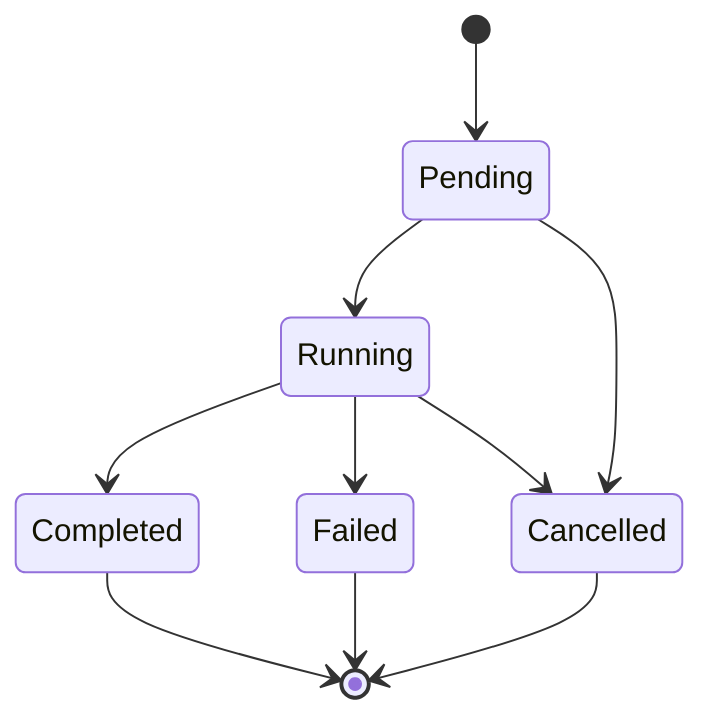

# Project Glossary

## Overview

This document manages the definitions of terms used within the Open Retouch project.
It is the ubiquitous-language definition used to keep terminology and notation consistent across all documents (`docs/`), code, and conversations.

Each entry lists the English term as the primary term, with the corresponding Japanese term (日本語) kept alongside to preserve the Japanese-English mapping.

**Last updated**: 2026-06-10

## Domain Terms

### Catalog (カタログ)

**Definition**: The collection of metadata managed by the app — photos, edits, albums, and so on. Physically, it is a SQLite database (`catalog.db`).

**Description**: Original image files themselves are not contained in the catalog (referenced files). The catalog stores photo file paths, EXIF data, ratings, edit parameters, and album structure.

**Related terms**: Referenced files, Non-Destructive Editing, Import

### Import (インポート / 取り込み)

**Definition**: The operation of scanning local folders/files and registering photos into the catalog.

**Description**: Original files are not moved, copied, or modified; they are registered in the DB as path references. EXIF reading and thumbnail generation run in the background. Photos with the same path are detected as duplicates and skipped.

**Related terms**: Catalog, Referenced files, Duplicate detection

### Referenced (non-managed) files (参照方式)

**Definition**: The approach of keeping only path references to files in the user's folders in the catalog, rather than copying original images into an app-managed folder.

**Description**: When an original file is moved or deleted, the photo enters the "missing" state (`photos.is_missing`).

### Non-Destructive Editing (非破壊編集)

**Definition**: An editing approach in which the original image file is never modified; edits are stored in the catalog as parameters (EditSettings JSON).

**Description**: On every display and export, the edit parameters are applied to the original image and rendered. Reset can return the photo to its unedited state at any time. This is the most important principle of the product.

**Related terms**: EditSettings, Edit Version, Render Pipeline

### EditSettings (編集パラメータ)

**Definition**: The data structure representing the edits applied to a single photo. It consists of basic adjustments (Basic), crop (Crop), and masks (Masks, P1), and is stored as JSON in `edits.edit_json`.

**Key fields**: `version` (schema version) / `basic` / `crop` / `masks`

**Related terms**: Non-Destructive Editing, Preset, Edit Version

**Implementation**: `OpenRetouch.Core/Editing/EditSettings.cs`

### Edit Version (編集バージョン)

**Definition**: A single snapshot in the edit history. Recorded in the `edits` table with a per-photo sequence number (`version`).

**Description**: Versions are committed per "edit session," not per slider operation. The limit is 50 versions per photo, with the oldest pruned first.

**Related terms**: Edit Session, Reset

### Edit Session (編集セッション)

**Definition**: The series of edit operations from when editing of a photo begins until the user switches to another photo (or explicitly takes a snapshot).

**Description**: Undo/Redo within a session is handled by an in-memory operation stack; when the session ends, the result is committed as an edit version.

### Preset (プリセット)

**Definition**: A named, saved subset of edit parameters (usually basic adjustments only) that can be reapplied to other photos.

**Description**: On application, a merge rule is followed: "only the parameters contained in the preset are overwritten" (crop and the like are preserved). Presets can be imported/exported as JSON files.

**Related terms**: Preset merge, Export Preset

### Export (書き出し / エクスポート)

**Definition**: The operation of outputting an image — with edit parameters applied — to a file in the specified format (JPEG/PNG/TIFF), size, and naming convention.

**Description**: Processed through the queue as a background job, with success/failure recorded per item. Only failed items can be reprocessed.

**Related terms**: Export Preset, File Name Template, Job

### Export Preset (書き出しプリセット)

**Definition**: A named, saved set of export settings (ExportSettings). Examples: "Web JPEG," "Instagram 4:5," "E-commerce product image."

**Note**: This is a different concept from an editing "Preset." Where context requires disambiguation, always write "Export Preset."

### File Name Template (ファイル名テンプレート)

**Definition**: A pattern string that generates export file names. Tokens: `{filename}` (original file name) / `{seq}` (sequence number) / `{date}` (capture date) / `{album}` (album name).

**Implementation**: `OpenRetouch.Core/Export/FileNameTemplate.cs`

### Album (アルバム / コレクション)

**Definition**: A logical grouping of photos, independent of the folder structure. A photo can belong to multiple albums (many-to-many).

**Description**: In this project, "Album" is the official term (equivalent to Lightroom's "Collection").

### Rating (星評価)

**Definition**: A 0–5 rating value assigned to a photo. 0 means unrated. Set with the keyboard keys `0`-`5`.

### Flag (フラグ)

**Definition**: A three-state mark on a photo: Pick / Reject / None. Operated with the keyboard keys `P` / `X` / `U`.

**Also known as**: Pick / Reject Flag

### Color Label (色ラベル)

**Definition**: A color classification attached to a photo (Red/Yellow/Green/Blue/Purple/None). Used for arbitrary workflow-specific meanings.

### Culling (選別)

**Definition**: The task of narrowing down keeper photos from a large set using star ratings and flags.

### Filmstrip (フィルムストリップ)

**Definition**: The horizontally scrolling row of photo thumbnails displayed at the bottom of the screen. Allows quick photo switching even in Edit Mode.

### Thumbnail / Preview (サムネイル / プレビュー)

| Term | Definition | Size | Usage |
|------|------|--------|------|
| Thumbnail (サムネイル) | Reduced-size image cache for grid display | 320 px long edge | Library Mode grid |
| Preview (プレビュー) | Base image cache for edit display | 2560 px long edge | Edit Mode render source |
| Draft preview (Draftプレビュー) | Low-resolution render result during slider operation | Matches the display area (~1280 px) | Immediate feedback within 200 ms |
| Full preview (Fullプレビュー) | High-resolution render result after the user stops adjusting | Preview size | Final review display |

### Before / After

**Definition**: A feature that compares the pre-edit (unedited) state with the post-edit state. Toggled with the keyboard key `\`.

### View Mode (画面モード)

**Definition**: The app's primary screen states. Library (management/culling) / Edit (editing) / Export (export dialog) / Settings.

**Related terms**: Library Mode, Edit Mode

## Technical Terms

### WinUI 3

**Definition**: The Windows-native UI framework included in the Windows App SDK.

**Official site**: https://learn.microsoft.com/windows/apps/winui/winui3/

**Usage in this project**: Building the entire app UI. The dark theme is enforced with `RequestedTheme="Dark"`.

### Windows App SDK

**Definition**: The SDK for using modern Windows capabilities (such as WinUI 3) in Win32 apps.

**Version**: 1.6 or later

### CommunityToolkit.Mvvm

**Definition**: An official Microsoft library that supports MVVM implementation. Its source generators auto-generate boilerplate such as `INotifyPropertyChanged`.

**Usage in this project**: The foundation of all ViewModels (`[ObservableProperty]`, `[RelayCommand]`).

### SQLite

**Definition**: An embedded, file-based relational database.

**Usage in this project**: Persistence of the catalog (`catalog.db`). Operated in WAL mode with migration management via `user_version`.

### WAL (Write-Ahead Logging)

**Definition**: One of SQLite's journal modes. By writing changes to a log file (`-wal`) first, it improves read/write concurrency and crash resilience.

**Usage in this project**: `catalog.db` is always opened in WAL mode.

### Dapper

**Definition**: A lightweight micro-ORM for .NET. Allows writing SQL directly while mapping results to types.

**Usage in this project**: All data access in the Catalog layer. Always used with parameterized queries.

### SkiaSharp

**Definition**: The .NET bindings for the Skia graphics engine.

**Usage in this project**: Image decoding/resizing/color adjustment/encoding. The version is fully pinned (to prevent rendering-result regressions).

### MetadataExtractor

**Definition**: A .NET library that reads metadata such as EXIF from image files.

**Usage in this project**: EXIF reading during import.

### LibRaw (P1)

**Definition**: A RAW image decoding library (C++).

**Usage in this project**: Planned for use in P1 for RAW decoding and embedded preview extraction via a native module.

### ONNX Runtime / DirectML (P1)

**Definition**: ONNX Runtime is an inference engine for machine learning models. DirectML is a GPU-vendor-agnostic Windows machine learning acceleration API.

**Usage in this project**: P1 local AI features (Auto Enhance, mask generation). CPU fallback is available.

## Abbreviations and Acronyms

### EXIF

**Full name**: Exchangeable Image File Format

**Meaning**: Capture-information metadata embedded in image files (capture date/time, camera, lens, ISO, aperture, shutter speed, GPS, etc.).

**Usage in this project**: Read at import time and stored in the DB. Retention/removal can be selected at export time.

### RAW

**Meaning**: File formats that record camera sensor data in a mostly unprocessed form (CR3/NEF/ARW, etc.). DNG is Adobe's universal RAW format.

**Usage in this project**: Out of scope for the MVP; phased support starting with embedded preview display in P1.

### MVVM

**Full name**: Model-View-ViewModel

**Meaning**: An architectural pattern that separates UI from logic. Views bind to ViewModels, and ViewModels operate on Models.

### MVP

**Full name**: Minimum Viable Product

**Meaning**: The minimum practical product. In this project, it refers to the P0 feature set in the PRD (F-01 through F-07).

**Note**: Not the Model-View-Presenter architectural pattern.

### P0 / P1 / P2

**Meaning**: Feature priority. P0 = MVP Must Have, P1 = MVP Should Have (immediately after initial release), P2 = future consideration (Post-MVP).

### HSL (P1)

**Full name**: Hue / Saturation / Luminance

**Meaning**: Per-color-range adjustment of hue, saturation, and luminance.

### ICC / Color Management (カラーマネジメント)

**Meaning**: A mechanism for matching color reproduction across devices based on ICC profiles. Used for color profile selection at export time. Full support (LittleCMS, 16-bit) is planned for the future.

### WYSIWYG

**Full name**: What You See Is What You Get

**Meaning**: The on-screen display matches the output result. In this project, this is guaranteed by routing both preview and export through the same render pipeline.

### OOM

**Full name**: Out Of Memory

**Meaning**: Memory exhaustion. Prevented by limiting the number of full-resolution images processed concurrently and by LRU caching.

## Architecture Terms

### Layered Architecture (レイヤードアーキテクチャ)

**Definition**: A design that separates responsibilities into layers and keeps dependencies one-directional.

**Application in this project**: App (UI) → Core (logic) → Catalog (persistence) / Imaging (image processing). Physically enforced via project references.

### Dependency Inversion (DIP) (依存性逆転)

**Definition**: The principle that higher-level modules depend on abstractions (interfaces) rather than on the implementations of lower-level modules.

**Application in this project**: Core defines interfaces in `Abstractions/`, and Catalog/Imaging implement them. DI registration happens in App's Composition Root.

### Composition Root

**Definition**: The application startup configuration area where all service registrations to the DI container are consolidated in one place.

**Application in this project**: `App.xaml.cs` in `OpenRetouch.App`. The only place where App may reference Catalog/Imaging.

### Job / Job Queue (ジョブ / ジョブキュー)

**Definition**: The execution unit representing a heavy operation (import, thumbnail generation, export, AI processing), and the infrastructure that executes such units with priority and parallelism control.

**Application in this project**: `IJob` / `IJobQueue` (Core/Jobs). The UI subscribes to the progress stream and displays it in the bottom bar.

### Render Pipeline (レンダリングパイプライン)

**Definition**: The chain of operations that applies edit parameters to an image. The processing order is fixed (Orientation → Crop → WB → Tone → Color → Detail → Resize → Encode).

**Application in this project**: A shared implementation (`RenderPipeline`) is used for both preview and export to guarantee WYSIWYG.

### UI Virtualization (仮想化リスト)

**Definition**: A display technique that materializes UI elements only for the visible viewport plus a buffer.

**Application in this project**: The photo grid and filmstrip. Enables smooth scrolling with a 10,000-photo catalog.

### Golden Image Testing (ゴールデン画像テスト)

**Definition**: A regression testing technique that compares processed result images against pre-approved expected images (goldens) within a tolerance.

**Application in this project**: `Imaging.Tests`. Also used to detect regressions when updating SkiaSharp.

### XMP Sidecar (XMPサイドカー)

**Definition**: A metadata file in the same folder as a RAW file, with the same name and the `.xmp` extension. Tools such as Lightroom store development settings, ratings, and labels in it.

**Application in this project**: Read at import time and converted into EditSettings (thumbnails are generated in the developed state); generated/updated when RAW edits are saved. Unsupported fields in existing XMP files are preserved, and the original RAW file is never written to.

### Steering File (ステアリングファイル)

**Definition**: The set of per-work-unit planning documents (requirements.md / design.md / tasklist.md under `.steering/[YYYYMMDD]-[task-name]/`).

**Application in this project**: Used for work planning and progress management in spec-driven development (see CLAUDE.md).

## Statuses and States

### JobStatus (ジョブステータス)

| Status | Meaning | Transition condition | Next states |
|----------|------|---------|---------|
| Pending | Waiting in the queue | Immediately after Enqueue | Running / Cancelled |
| Running | Executing | Picked up by a worker | Completed / Failed / Cancelled |
| Completed | Completed successfully | Processing succeeded | (terminal) |
| Failed | Failed | Exception raised (after retries) | (terminal; re-enqueue creates a new job) |
| Cancelled | Cancelled | User action | (terminal) |

### Flag States (PhotoFlag) (フラグ状態)

| State | Meaning | Key |
|------|------|-----|
| None | Not set (未設定) | `U` |
| Pick | Keeper (採用) | `P` |
| Reject | Rejected (不採用) | `X` |

### Special Photo States (写真の特殊状態)

| State | Meaning | Display |
|------|------|------|
| Missing (`is_missing=1`) | The original file cannot be found (行方不明) | "!" badge on the thumbnail; editing disabled |
| Thumbnail not yet generated (サムネイル未生成) | Waiting for background generation | Placeholder shown |

## Data Model Terms

### photos

**Definition**: The central entity representing a single photo in the catalog.

**Key fields**: `file_path` (unique; duplicate-detection key) / `rating` / `flag` / `color_label` / EXIF-related columns / `is_missing`

**Related entities**: folders (membership) / edits (one-to-many) / albums (many-to-many via photo_album_map)

### edits

**Definition**: The edit version history of a photo. EditSettings is stored in `edit_json`.

**Constraints**: `UNIQUE(photo_id, version)`. The row with `is_current=1` is the currently applied version.

### presets

**Definition**: Edit presets. A subset of EditSettings is stored in `preset_json`.

### export_jobs / export_job_items

**Definition**: Export jobs and their items (one per photo). Success/failure (`status` / `error_message`) is recorded per item, enabling reprocessing of failures only.

### thumbnail_cache

**Definition**: File paths of thumbnail/preview caches and the information used for invalidation decisions (`source_modified_at`).

## Errors and Exceptions

### ImageDecodeException

**Raised when**: Decoding fails due to a corrupted file, a spoofed extension, or an unsupported format.

**Handling**: Skip the file and record it in the import failure list. The app must not crash.

### ImageTooLargeException

**Raised when**: A decode is requested for an image whose declared resolution exceeds the limit (to prevent memory exhaustion).

**Handling**: Skip and record in the failure list.

### ExportItemFailedException

**Raised when**: Processing of an export item fails (encoding failure, insufficient disk space, etc.).

**Handling**: Mark the item as `failed` and let the job continue. The user can retry only the failed items.

### CatalogCorruptedException

**Raised when**: The startup `PRAGMA integrity_check` fails.

**Handling**: A recovery dialog offers restoration from backups (the 5 most recent generations).

## Notation Rules

- Documents and the UI use English terms as the base language (since 2026-06-12). This glossary keeps the corresponding Japanese term alongside each entry to preserve the Japanese-English mapping (e.g., "Preset (プリセット)")
- Code (class names, variable names) follows the English terms in this glossary (e.g., Culling, Export)
- "Export" is the standard term; avoid synonyms such as "output" or "save as" in UI and documents
- "Album" is the standard term; "Collection" is a synonym and is not used in this project
